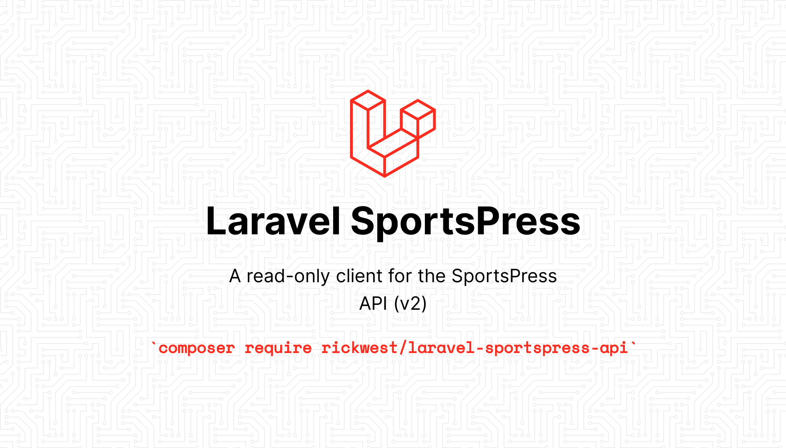

[](https://packagist.org/packages/rickwest/laravel-sportspress-api)
[](https://github.com/rickwest/laravel-sportspress-api/actions/workflows/run-tests.yml)
[](https://github.com/rickwest/laravel-sportspress-api/actions/workflows/php-cs-fixer.yml)
[](https://github.com/rickwest/laravel-sportspress-api/actions/workflows/php-cs-fixer.yml)
[](https://packagist.org/packages/rickwest/laravel-sportspress-api)
[](LICENSE.md)

An unambitious read-only client for the SportsPress REST API (v2). This package is built on top of my [Laravel WordPress API package](https://github.com/rickwest/laravel-wordpress-api), and provides an expressive, fluent, Laravel-esque way of querying the SportsPress API.

```php
// Without the package 👎
Http::get('https://example.com/wp-json/sportspress/v2/players', [
    'search' => 'lebron',
    '_embed' => 1,
    'orderby' => 'date',
    'order' => 'desc'
    '_fields' => 'title',
]);


// Using the package 👌
SportsPress::players()
    ->search('lebron')
    ->embed()
    ->latest()
    ->get('title');
```

As well as the fluent query builder, you also benefit from a nicely formatted response, including pagination information.

```php
// Without the package 👎
$response = Http::get('https://example.com/wp-json/sportspress/v2/players');
$data = $response->json();
$pages = $response->header('X-WP-TotalPages');
$total = $response->header('X-WP-Total');


// Using the package 👌
$players = SportsPress::players()->get();

// $posts
[
    'data' => [...],
    'meta' => [
        'pages' => 1,
        'total' => 10,
    ],
],

```

## Installation

You can install the package via composer:

```bash
composer require rickwest/laravel-sportspress-api
```

Then you need to add your WordPress url to your `.env` file:

```dotenv
WORDPRESS_URL=https://example.com
```

## Usage

This package binds a singleton to the Laravel service container, so you can easily resolve the WordPress client directly from the container, or via dependency injection.
Alternatively, the package also exposes both a Facade and a helper function should you prefer a shorter more expressive option.

The package has support for the following SportsPress resources: *calendars, events, leagues, players, positions, roles, seasons, staff, teams, venues*.

```php
// Resolve service directly from container and access the Players API
app(SportsPress::class)->players();

// Resolve via Facade and access the Players API
SportsPress::players(); 

// Resolve service via helper and access the Players API
sportspress()->players();

// Supported resources
SportsPress::calendars() // Access the Calendars API
SportsPress::events() // Access the Events API
SportsPress::leagues() // Access the Leagues API
SportsPress::players() // Access the Players API
SportsPress::postitions() // Access the Positions API
SportsPress::roles() // Access the Roles API
SportsPress::seasons() // Access the Seasons API
SportsPress::staff() // Access the Staff API
SportsPress::teams() // Access the Teams API
SportsPress::venues() // Access the Venues API

// You can also access resources as properties
sportspress()->players
```

### Retrieving resource

Call the `find` method on a resource class in order to get a single resource by ID:``

```php
SportsPress::players()->find(1);
```

For more examples, detailed usage and a full list of available options, please see https://github.com/rickwest/laravel-wordpress-api#retrieve-a-single-resource

### Retrieve a collection of resources

Call the `get` method on a resource to retrieve a collection of resources. The response you receive can be controlled and filtered using various parameters, https://developer.wordpress.org/rest-api/reference/.
This package provides some fluent builder methods in order to easily and expressively build your desired query. Collection responses are then nicely formatted and include useful pagination information.

```php
SportsPress::players()->get();
```
For more examples, detailed usage and a full list of available options, please see https://github.com/rickwest/laravel-wordpress-api#creating-updating-and-deleting-resources

### Creating, updating and deleting resources

Whilst this package is primarily intended for reading data from the SportsPress API, it is possible to perform write operations using the `send` method on a resource class.

```php
SportsPress::players()->send(string $method, int $id, array $options);
```

For more examples, detailed usage and a full list of available options, please see https://github.com/rickwest/laravel-wordpress-api#retrieve-a-collection-of-resources

## Testing

```bash
composer test
```

## Changelog

Please see [CHANGELOG](CHANGELOG.md) for more information on what has changed recently.

## Contributing

Please see [CONTRIBUTING](CONTRIBUTING.md) for details.

## Security Vulnerabilities

Please review [our security policy](../../security/policy) on how to report security vulnerabilities.

## Credits

- [Rick West](https://github.com/rickwest)
- [All Contributors](../../contributors)

## License

The MIT License (MIT). Please see [License File](LICENSE.md) for more information.
